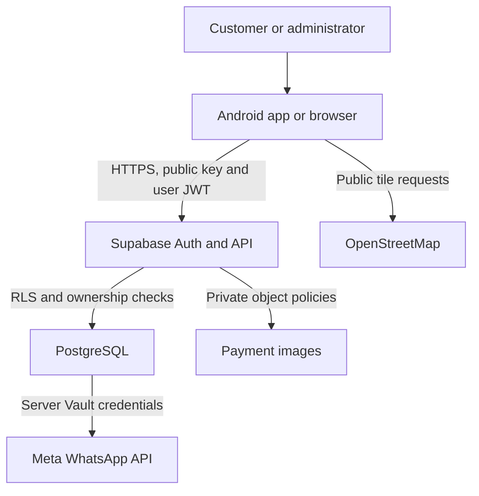

# Technical design - v0.6.4

## Components and boundaries

The Android activity hosts bundled HTML/CSS/JavaScript under a local HTTPS origin. Only the explicit asset allowlist can be served there. External HTTP(S)/email links open through Android. File/content access and mixed content are disabled. The geolocation callback checks the app origin before requesting coarse/fine Android permission. Manual map coordinates remain available after denial or timeout.

`app.js` manages rendering and workflows; `core.js` contains validation, totals and escaping; `backend.js` handles Supabase Auth, REST/RPC and Storage. The adapter enforces a request timeout and serialises token refresh. Client checks help users; database policies and RPCs enforce authority.

The device is outside the trusted database boundary. No role flag or posted price is trusted. The database calculates service/add-on totals, locks the appointment date, uses a unique active-slot index and deduplicates a customer's retry UUID. Shared availability exposes only slot time/status, including occupancy by other customers. It refreshes on schedule entry/date change or explicit Refresh; the final database write rejects races. It is not a continuous realtime subscription.

## Data model

| Entity | Link and responsibility |
| --- | --- |
| Auth user / profile | Profile UUID references Auth identity; protected customer/admin role |
| Services | Published catalogue, prices and stable add-on identifiers |
| Availability overrides | Unique date/time, admin-managed open/blocked state |
| Bookings | Owner, service snapshot, slot, location, request UUID, workflow and payment state |
| Payment proof object | Private path scoped to owner and booking; path referenced by booking |
| Receipts | One receipt per completed paid booking; amount/method/date linked to that booking |
| Settings | Public business/MMG details, atomically updated by administrator |
| Notification log | Server integration attempts; provider delivery needs separate verification |

Connected personal records stay in memory and are cleared at logout. Only theme preferences are written to the app-state cache; Auth tokens remain in local storage for session continuity. Demo records are local, fictional and use public passwords. Browser/Android secure-origin checks do not replace a device-security or penetration review.

## Design decisions and debt

The map is OpenStreetMap with browser geolocation. Google Maps was not integrated. No external JavaScript map library or API key is loaded. User-controlled service fields are escaped and the page CSP excludes external scripts. Dark/light colour tokens and accessible labels share one UI. Forms preserve details while a location modal is open and commit changes only after a successful backend response.

A receipt makes core financial/service fields immutable through the booking trigger; real refunds/adjustments require a separately designed reviewed workflow. Administrator deletion remains available for prototype cleanup and cascades to linked receipts; the UI must accurately warn about shared deletion. A production retention/audit strategy is still required. Historical uploads need reconciliation and object-byte backups. The private proof bucket restricts claimed MIME type and size, but does not implement antivirus scanning or independent file-signature inspection.

There is no verified background/offline write queue, push-notification delivery guarantee, password-recovery hosting or automatic orphan-file cleanup in this repository. CI is prepared but awaits its first actual GitHub run. These are documented deployment limits, not reported as completed tests.

Reference: [Android WebView guidance](https://developer.android.com/develop/ui/views/layout/webapps/managing-webview), [PGlite snapshot API](https://pglite.dev/docs/api).

## Refresh interaction (v0.6.1)

`pull-refresh.js` owns the touch gesture and a single-request loading state; `app.js` determines eligible screens and reuses the existing backend refresh path. Refresh does not reload the WebView. The indicator is outside the rerendered content. The keyboard action appears on focus; live-region messages announce progress and outcome. Reduced-motion settings disable spinner animation.

## Admin feedback repair (v0.6.2)

The authenticated profile remains separate from directory completeness. Refresh operations preserve that profile while merging other customer records. Auth refresh is serialized per login generation, and rejected resource requests receive at most one retry with a renewed token. Definitive refresh-token/session error codes clear identity; network and generic permission failures do not. Ordinary logout explicitly uses local scope. See [Supabase sign-out scopes](https://supabase.com/docs/guides/auth/signout) and [Auth error codes](https://supabase.com/docs/guides/auth/debugging/error-codes).

Add-on fieldsets preserve database JSON structure and IDs, independent of names or description punctuation. Month filtering applies to appointment dates, with Guyana-local creation dates for walk-ins. The native Back handler first evaluates the page's synchronous dialog-dismissal hook; browser history handling has the same visible behaviour. Every HTML asset must pass the native asset allowlist test.

## Encrypted session storage (v0.6.3 feature branch)

`session-store.js` owns the cached session. On Android's bundled HTTPS origin it uses a three-method `SessionVault` bridge. The bridge is enabled by main-document navigation checks, remote main documents are denied, and CSP excludes child frames/workers. Every encrypted write uses a fresh provider-generated 96-bit IV and 128-bit authentication tag, with a versioned envelope and fixed application-specific associated data. `SessionCipher` is exercised directly in JVM tests. `SessionVault` uses Android Keystore AES-256 keys and `AtomicFile` ciphertext writes in the no-backup directory; it checks the resulting bytes before acknowledging a write.

An existing encrypted session takes precedence over any legacy token. Migration writes the legacy value through the vault before removing localStorage. Failed migration leaves the old copy pending, exposes a warning and returns no active session. Write failures clear runtime identity and attempt native cleanup; they never store new tokens in localStorage. Sign-out attempts both local removal and remote revocation. A key that is lost or ciphertext that cannot authenticate produces a visible failure; fresh sign-in can replace unreadable data. Browser previews use in-memory sessions and require another sign-in after reload.

Reference design guidance: [Android Keystore](https://developer.android.com/privacy-and-security/keystore), [cryptography](https://developer.android.com/privacy-and-security/cryptography), and [native bridge risks](https://developer.android.com/privacy-and-security/risks/insecure-webview-native-bridges). This is encryption at rest, not protection from runtime XSS or a compromised OS. No hardware-backed-key or biometric claim is made without device testing.

## Administrator MFA (v0.6.4)

The account bootstrap checks `admin_mfa_status()` before querying privileged records. A pending-MFA state holds only the current user's profile and transient enrolment/factor metadata, clears admin records and pins navigation to verification. Backend TOTP methods use `/auth/v1/factors`, `/challenge`, `/verify`, and the authoritative `/auth/v1/user` factor list. Verification validates six-digit input, serializes with refresh, preserves leading zeroes, checks login-generation races and saves the newly issued session before the server authorisation recheck. Error paths never infer admin access from a successful-looking client response. Setup uses a QR image/manual key, verified-factor selection and guarded cancellation of unfinished factors.

The standalone SQL migration tightens the existing `is_admin()` dependency shared by RLS and privileged RPCs; it leaves customer ownership policies intact. This is staged deployment work: neither live database enforcement nor actual factor enrolment has been performed. See [the rollout guide](ADMIN-MFA-ROLLOUT.md).
